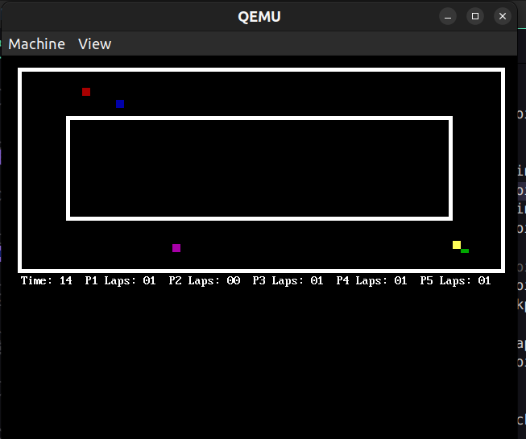
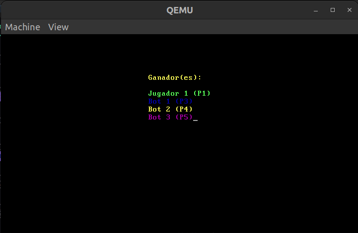

# Gran Trak TEC - Juego de Carreras en Ensamblador x86 

Este proyecto implementa un sencillo juego de carreras multijugador escrito en lenguaje ensamblador x86, diseñado para ejecutarse directamente sobre el hardware sin necesidad de un sistema operativo. El juego incluye dos jugadores controlados por humanos y tres bots controlados por el CPU con rutas aleatorias

## Descripción del Juego

El juego consiste en una carrera de 60 segundos donde los jugadores deben completar la mayor cantidad posible de vueltas en una pista. Al finalizar el tiempo, se determina el ganador basado en el número de vueltas completadas.

<p align="center">
  <a href="https://github.com/henryda2004/GranTrakTEC/blob/main/Figuras/gameSet.png" target="blank"></a>
</p>

<p align="center">
  <a href="https://github.com/henryda2004/GranTrakTEC/blob/main/Figuras/gameWinners.png" target="blank"></a>
</p>

### Características

- **Modo gráfico VGA** (640x480 con 16 colores)
- **Dos jugadores humanos** controlados por teclado
- **Tres bots** controlados por el CPU 
- **Sistema de conteo de vueltas** mediante checkpoints
- **Detección de colisiones** con la pista
- **Temporizador** de 60 segundos
- **Velocidades aleatorias** para los bots en cada partida
- **Pantalla de resultados** que muestra el ganador al finalizar

### Controles

- **Jugador 1 (Verde)**: Flechas de dirección (↑, ↓, ←, →)
- **Jugador 2 (Rojo)**: Teclas WASD (W=arriba, S=abajo, A=izquierda, D=derecha)

## Estructura del Proyecto

El proyecto está dividido en dos componentes principales:

1. **`boot1.asm`**: Bootloader que se encarga de cargar la segunda etapa del juego
2. **`stage.asm`**: Segunda etapa que contiene el código principal del juego

La primera etapa (`boot1.asm`) es un bootloader básico que se carga en la dirección 0x7C00 y se encarga de cargar la segunda etapa en la dirección 0x1000:0. La segunda etapa (`stage.asm`) contiene todo el código del juego, incluyendo la lógica de movimiento, la detección de colisiones, el conteo de vueltas y la visualización.

## Detalles Técnicos

### Tecnologías Utilizadas

- **Lenguaje Ensamblador x86** (sintaxis NASM)
- **Programación en Modo Real** (16 bits)
- **Interrupciones BIOS** para E/S:
 - INT 0x10: Servicios de video (modos gráficos, dibujo de píxeles)
 - INT 0x16: Servicios de teclado
 - INT 0x1A: Servicios de tiempo (temporizador)
- **Emulador QEMU** para ejecución y pruebas

### Compilación y Ejecución

#### Usando Visual Studio Code

1. Instala las dependencias necesarias:
  - NASM (ensamblador)
  - QEMU (emulador)

2. En Visual Studio Code, presiona `Ctrl + Shift + B` para compilar y ejecutar el juego. Esto utiliza el archivo `tasks.json` para ensamblar el código y ejecutarlo en QEMU.


```json
{
   "version": "2.0.0",
   "tasks": [
       {
           "label": "Compilar y Ejecutar en QEMU",
           "type": "shell",
           "command": "nasm -f bin stage.asm -o stage.bin && nasm -f bin boot1.asm -o boot1.bin && cat boot1.bin stage.bin > disk.img && qemu-system-i386 -fda disk.img -boot a",
           "group": {
               "kind": "build",
               "isDefault": true
           },
           "problemMatcher": []
       }
   ]
}
```


#### Usando Makefile

Alternativamente, puedes utilizar el Makefile incluido en el proyecto:

1. Ejecuta `make` para compilar y ejecutar el juego. 
2. Ejecuta `make clean` para limpiar los archivos generados. 

El Makefile implementa las mismas operaciones que el archivo tasks.json pero ofrece más flexibilidad:

```makefile
# Makefile para el juego de carreras

# Herramientas
NASM = nasm
QEMU = qemu-system-i386

# Archivos
BOOT = boot1
STAGE = stage
IMAGE = disk.img

# Reglas
all: run

# Compilar el bootloader
$(BOOT).bin: $(BOOT).asm
	$(NASM) -f bin $< -o $@

# Compilar el stage 2
$(STAGE).bin: $(STAGE).asm
	$(NASM) -f bin $< -o $@

# Crear la imagen de disco
$(IMAGE): $(BOOT).bin $(STAGE).bin
	cat $(BOOT).bin $(STAGE).bin > $(IMAGE)

# Compilar y ejecutar en QEMU
run: $(IMAGE)
	$(QEMU) -fda $(IMAGE) -boot a

# Limpiar archivos generados
clean:
	rm -f *.bin $(IMAGE)

.PHONY: all run clean
```

#### Compilación Manual

Si prefieres compilar manualmente, ejecuta los siguientes comandos:

```bash
# Ensamblar la segunda etapa
nasm -f bin stage.asm -o stage.bin

# Ensamblar el bootloader
nasm -f bin boot1.asm -o boot1.bin

# Unir ambos en una imagen de disco
cat boot1.bin stage.bin > disk.img

# Ejecutar en QEMU
qemu-system-i386 -fda disk.img -boot a
```

## Funcionamiento Interno

### Sistema de Bootloading

- El BIOS carga el sector de arranque (`boot1.bin`) en la dirección `0x7C00`.
- El bootloader configura los segmentos y carga la segunda etapa (`stage.bin`) en la dirección `0x1000:0`.
- El control se transfiere a la segunda etapa, que inicializa el modo gráfico y comienza el juego.

### Sistema para los Bots

Los bots utilizan un sistema de waypoints (puntos de ruta) para navegar por la pista:

- Cada bot tiene una dirección y velocidad actual.
- El sistema verifica si el bot ha llegado a un waypoint.
- Cuando un bot llega a un waypoint, cambia su dirección según lo definido para ese punto.
- Las velocidades de los bots se determinan aleatoriamente al inicio de cada partida.

### Sistema de Conteo de Vueltas

Para evitar trampas, el sistema utiliza dos checkpoints en la pista:

- **Checkpoint 1**: Ubicado en la parte superior de la pista.
- **Checkpoint 2**: Ubicado en la parte inferior de la pista.

Para que se cuente una vuelta completa, un jugador o bot debe pasar por el **Checkpoint 1** y luego por el **Checkpoint 2** en ese orden.

---

## Requisitos

- **NASM**: Para ensamblar el código.
- **QEMU**: Para emular y ejecutar el juego.
- **Make** (opcional): Para usar el `Makefile`.


